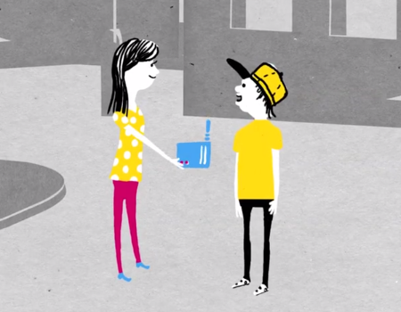
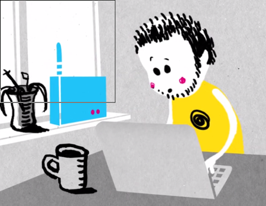
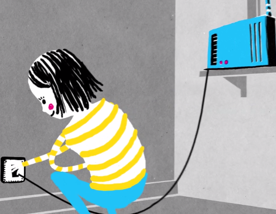

### Unterstütze dein lokales Freifunk-Netz!

Du kannst bei Freifunk Darmstadt mitmachen, indem du einen oder mehrere Freifunk WLAN-Router aufstellst. 

Und so funktioniert's:

	

		<section class="box special">
			
			<ul class="actions">
				<li><a href="/mitmachen/unterstuetzte-geraete/" class="button accent2">1. Besorge kompatiblen Router</a></li>
			</ul>
		</section>
		
	

	

		<section class="box special">
			
			<ul class="actions">
				<li><a href="/mitmachen/firmware-installieren/" class="button accent3">2. Installiere die Firmware</a></li>
			</ul>
		</section>

	

	

		<section class="box special">
			
			<ul class="actions">
				<li><a href="/mitmachen/router-aufstellen/" class="button accent4">3. Schließ den Router an</a></li>
			</ul>
		</section>

	

### Wie kann ich sonst noch helfen?

Um uns weiter zu unterstützen, kannst du auch [Dienste im Netzwerk zur Verfügung stellen](/lokale-dienste/), oder, wenn du nicht technisch versiert bist, uns helfen Werbematerial zu gestalten sowie Pressearbeit zu übernehmen. [Spenden](/kontakt/) helfen uns zudem Infrastruktur als auch Werbematerialien zu finanzieren.

